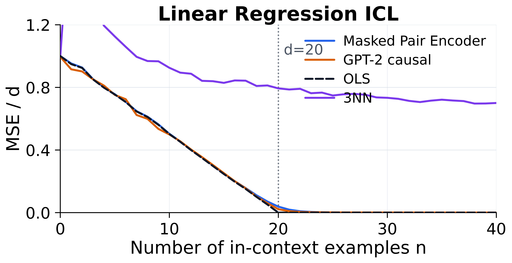
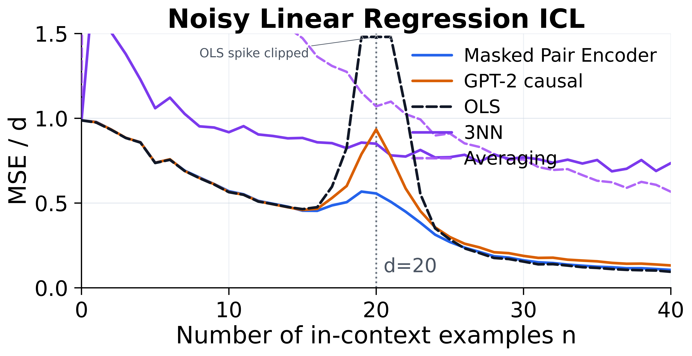
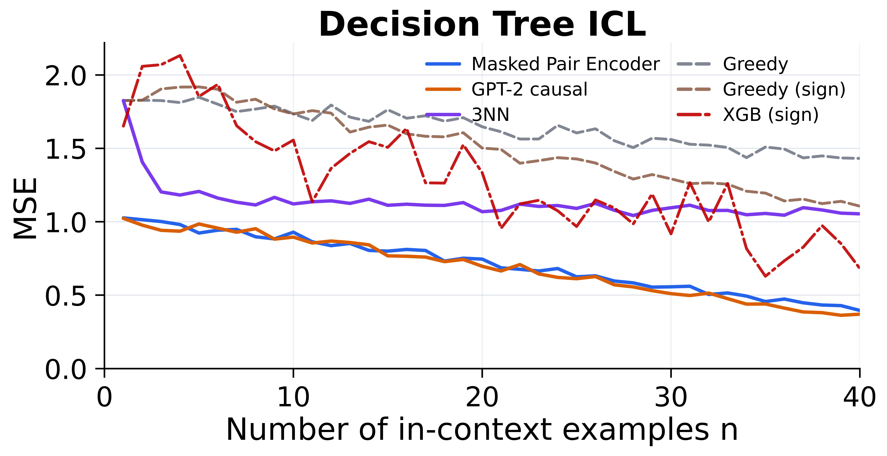
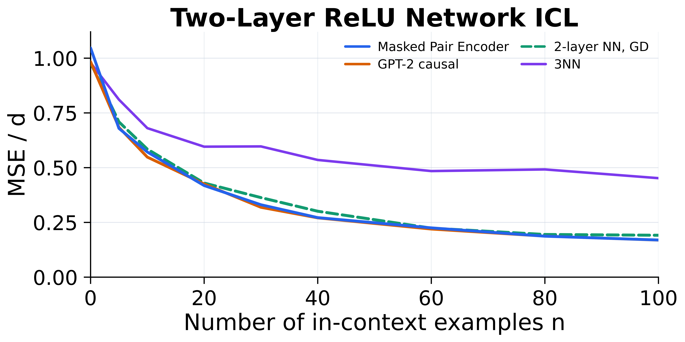

# Masked In-Context Learning for Synthetic Function Classes

This repository contains a clean, reproducible implementation of masked
in-context learning (ICL) on synthetic function-class prompts. The main
question is whether a bidirectional masked objective can learn algorithmic
function inference behavior comparable to the causal GPT-2 style Transformers
studied in prior synthetic ICL work.

The claim is deliberately narrow: this is not about making BERT generate text.
It tests whether masked prediction over labels can produce in-context function
learning in controlled synthetic settings.

## Main Results

The repository ships four publication-style single-task figures generated
directly from the checked-in CSV curves. Linear, noisy linear, and two-layer
ReLU regression use normalized squared error (`MSE / d`); decision-tree
regression uses raw squared error because the tree leaf variance is already
order one.

### Linear regression

For `d=20` linear regression, a Masked Pair Encoder and a causal
GPT-2 baseline both enter the near-OLS regime once the prompt has enough
in-context examples. The reported metric is normalized squared error,
`MSE / d`, matching the noisy-linear figure.



Held-out full-curve evaluation with 64 batches:

| n | Masked Pair Encoder | GPT-2 causal | OLS | 3NN |
|---:|---:|---:|---:|---:|
| 5 | 0.7559 | 0.7520 | 0.7545 | 1.1254 |
| 10 | 0.5038 | 0.4992 | 0.5021 | 0.9253 |
| 20 | 0.0382 | 0.0217 | ~0 | 0.7937 |
| 25 | 0.0016 | 0.0015 | ~0 | 0.7481 |
| 30 | 0.0005 | 0.0008 | ~0 | 0.7334 |
| 40 | 0.0005 | 0.0005 | ~0 | 0.7002 |

### Noisy linear regression

The same noiseless linear checkpoints are evaluated on
`noisy_linear_regression` with `noise_std=1`. The main checked-in curve uses
population-level label renormalization and reports `MSE / d`, so the zero
estimator is near one. An earlier batch-renormalized CSV is retained only as a
record of the initial diagnostic run.



Held-out full-curve evaluation with 64 batches:

| n | Masked Pair Encoder | GPT-2 causal | OLS | 3NN | Averaging |
|---:|---:|---:|---:|---:|---:|
| 5 | 0.7384 | 0.7374 | 0.7363 | 1.0594 | 4.2190 |
| 10 | 0.5697 | 0.5650 | 0.5641 | 0.9179 | 2.1971 |
| 20 | 0.5564 | 0.9340 | 10292.9766 | 0.8499 | 1.0706 |
| 25 | 0.2702 | 0.2994 | 0.2852 | 0.7705 | 0.9106 |
| 30 | 0.1621 | 0.1881 | 0.1546 | 0.7698 | 0.7570 |
| 40 | 0.1054 | 0.1318 | 0.0945 | 0.7356 | 0.5666 |

### Decision trees

For depth-4 decision trees, the masked model tracks the causal GPT-2 baseline
closely and substantially outperforms nearest-neighbor, greedy-tree, and
sign-preprocessed XGBoost baselines in the high-context regime.



Matched-seed held-out evaluation:

| n | Masked Pair Encoder | GPT-2 causal | 3NN | Greedy tree | Greedy tree (sign) | XGBoost (sign) |
|---:|---:|---:|---:|---:|---:|---:|
| 20 | 0.7458 | 0.6968 | 1.0687 | 1.6473 | 1.5022 | 1.3351 |
| 25 | 0.6250 | 0.6123 | 1.0910 | 1.6054 | 1.4282 | 0.9678 |
| 30 | 0.5570 | 0.5103 | 1.0954 | 1.5605 | 1.2923 | 0.9179 |
| 40 | 0.3961 | 0.3705 | 1.0540 | 1.4318 | 1.1064 | 0.6818 |

### Two-layer ReLU networks

For random two-layer ReLU networks with `d=20` and 100 hidden units, the
Masked Pair Encoder closely tracks both the causal GPT-2 baseline and the
per-prompt gradient-trained two-layer neural-network reference.



Held-out evaluation with `MSE / d` normalization:

| n | Masked Pair Encoder | GPT-2 causal | 2-layer NN, GD | 3NN |
|---:|---:|---:|---:|---:|
| 20 | 0.4182 | 0.4254 | 0.4297 | 0.5957 |
| 40 | 0.2718 | 0.2707 | 0.3009 | 0.5351 |
| 60 | 0.2250 | 0.2195 | 0.2237 | 0.4843 |
| 80 | 0.1868 | 0.1872 | 0.1948 | 0.4918 |
| 100 | 0.1695 | 0.1691 | 0.1912 | 0.4519 |

The `2-layer NN, GD` label follows the convention used in prior synthetic ICL
work. In this repository the reference is implemented as a fresh two-layer ReLU
network trained independently on each prompt with Adam (`lr=5e-3`, 100 steps).

## Repository Layout

```text
src/                                  Core models, tasks, samplers, training utilities
scripts/train_synthetic_icl.py         Unified synthetic ICL training driver
scripts/eval_checkpoint_curve.py       Checkpoint evaluation over prompt lengths
scripts/eval_noisy_linear_regression.py Noisy linear evaluation
scripts/plot_linear_regression.py        Recreates the linear-regression figure
scripts/plot_noisy_linear_regression.py
scripts/plot_decision_tree.py
scripts/plot_relu_2nn.py
scripts/plotting_style.py                Shared publication plotting style
tests/                                Unit tests for objectives, configs, and scripts
results/linear_regression/            Published curves, figures, and raw summaries
results/noisy_linear_regression/      Noisy linear robustness curve and figure
results/decision_tree/                Published curves and final paper-style figure
results/relu_2nn_regression/          Two-layer ReLU experiment outputs
reproduce/                            PowerShell commands for training/evaluation/plotting
```

Local working copies can retain `runs*` training folders and `.pt` checkpoints
for audit. Those large artifacts are ignored by default for normal Git commits;
use Git LFS or GitHub Release assets if you want to publish them with the
repository. The compact CSV curves and paper figures included here are enough
to regenerate all displayed plots.

## Environment

Create the conda environment:

```bash
conda env create -f environment.yml
conda activate masked-icl
pip install -r requirements.txt -r requirements-dev.txt
```

The main experiments were run on NVIDIA RTX A6000 GPUs. The code also supports
single-GPU execution; reduce batch size for smaller GPUs.

## Reproduce Figures

The checked-in CSVs are enough to regenerate the published plots:

```bash
python scripts/aggregate_linear_regression.py \
  --raw-dir results/linear_regression/raw \
  --out-csv results/linear_regression/curves/linear_regression_icl.csv \
  --n-dims 20 \
  --normalize-by-d

python scripts/plot_linear_regression.py \
  --curve_csv results/linear_regression/curves/linear_regression_icl.csv \
  --out_dir results/linear_regression/figures

python scripts/plot_decision_tree.py \
  --curve-csv results/decision_tree/curves/decision_tree_icl.csv \
  --out-dir results/decision_tree/figures

python scripts/plot_noisy_linear_regression.py \
  --curve-csv results/noisy_linear_regression/curves/noisy_linear_regression_icl.csv \
  --out-dir results/noisy_linear_regression/figures
```

On Windows PowerShell:

```powershell
.\reproduce\aggregate_linear_regression.ps1
.\reproduce\eval_noisy_linear_population.ps1
.\reproduce\plot_linear_regression.ps1
.\reproduce\plot_noisy_linear_regression.ps1
.\reproduce\plot_decision_tree.ps1
.\reproduce\plot_all_figures.ps1
```

When the two-layer ReLU curve CSV is present, `plot_all_figures.ps1` also
regenerates its single-task figure.

See [REPRODUCIBILITY.md](REPRODUCIBILITY.md) for the release checklist and
command map. See [ARTIFACTS.md](ARTIFACTS.md) for the local result/checkpoint
retention policy.

## Reproduce Training

Training commands are documented in:

- `reproduce/train_linear_masked.ps1`
- `reproduce/train_linear_gpt2.ps1`
- `reproduce/train_decision_tree_masked.ps1`
- `reproduce/train_decision_tree_gpt2.ps1`
- `reproduce/train_relu_2nn_masked.ps1`
- `reproduce/train_relu_2nn_gpt2.ps1`
- `reproduce/eval_relu_2nn_neural.ps1`
- `reproduce/eval_relu_2nn_baselines.ps1`
- `reproduce/assemble_relu_2nn_curve.ps1`
- `reproduce/plot_relu_2nn.ps1`
- `reproduce/eval_gpt2_full_curve.ps1`
- `reproduce/eval_noisy_linear_population.ps1`
- `reproduce/eval_decision_tree_baselines.ps1`
- `reproduce/assemble_decision_tree_curve.ps1`
- `reproduce/plot_all_figures.ps1`
- `reproduce/smoke_test.ps1`

Full pretraining from scratch is intended for GPU machines. On an RTX
A6000-class GPU, the full causal GPT-2 baseline takes hours rather than
minutes. The smoke test uses tiny models and two training steps only; it is for
validating that the repository runs end-to-end, not for reproducing the paper
curve.

## Upstream Attribution

This repository builds on the synthetic ICL setup and baseline model structure
from:

> Garg, Tsipras, Liang, and Valiant. "What Can Transformers Learn In-Context?
> A Case Study of Simple Function Classes." 2022.

The causal GPT-2 baseline is trained from scratch on synthetic prompts; it does
not use natural-language pretrained GPT-2 weights.

## Sanity Checks

The packaged repository is checked with:

```bash
python -m py_compile scripts/train_synthetic_icl.py scripts/eval_checkpoint_curve.py scripts/eval_gpt2_linear_curve.py scripts/eval_noisy_linear_regression.py scripts/eval_decision_tree_baselines.py scripts/eval_relu_2nn_baselines.py scripts/aggregate_linear_regression.py scripts/assemble_decision_tree_curve.py scripts/assemble_relu_2nn_curve.py scripts/plot_linear_regression.py scripts/plot_noisy_linear_regression.py scripts/plot_decision_tree.py scripts/plot_relu_2nn.py scripts/plotting_style.py
python -m ruff check .
python -m pytest -q
.\reproduce\plot_all_figures.ps1
```

For an end-to-end local check on Windows:

```powershell
.\reproduce\smoke_test.ps1
```

Expected unit-test result: `43 passed`.

## License

MIT. See `LICENSE`.
